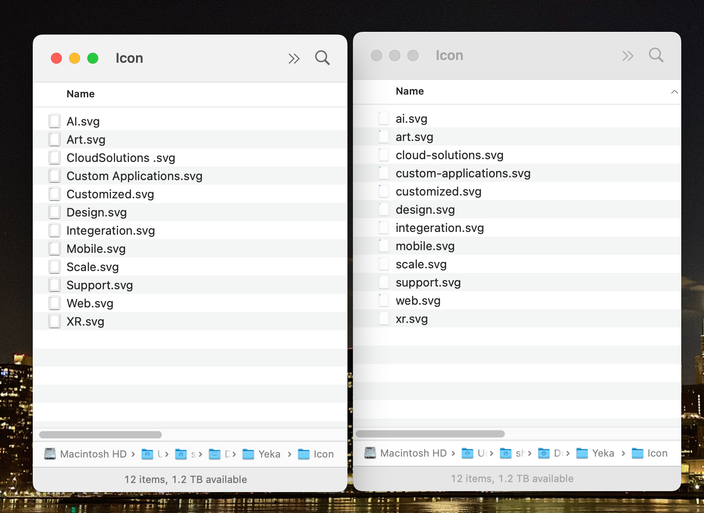

# File Name Sanitizer: `Great Asset.png` -> `great-asset.png`
##### Prepare assets for development! Simply renames files in a folder to kebab-case.



This script allows you to rename files in a directory to kebab-case format (lowercase with hyphens), making them more suitable for development purposes. It's particularly useful when working with files received from UI/UX and product designers, as their original names may contain spaces, a mix of capital and lowercase letters, and other characters that are not ideal for development workflows.

## Prerequisites

- Bash (compatible with macOS and Linux)
- Basic knowledge of using the terminal

## Installation

1. Download the script file `sanitize.sh` from this repository.
2. Open a terminal.

## Usage

1. Navigate to the directory where the script file is located.
   ```shell
   cd /path/to/script/directory
   ```

2. Make the script file executable.
   ```shell
   chmod  x sanitize.sh
   ```

3. Run the script with the target directory as an argument.
   ```shell
   ./sanitize.sh /path/to/target/directory
   ```

   The script will perform a dry run, showing the proposed renamed files without making any changes.

4. Review the dry run output and confirm whether you want to proceed with renaming the files.
   - If you choose to proceed, enter `y` or `Y` when prompted.
   - If you want to cancel the operation, enter any other character.

   **Note:** It's recommended to test the script on a backup or sample directory first before using it on your actual files.

## Example

Let's say you have the following files in the target directory:

- My_File_1.txt
- Another_File_2.jpg
- Some File 3.png

Running the script will perform a dry run and display the proposed renamed files:

```
Dry run: Renamed files
======================
My_File_1.txt => my-file-1.txt
Another_File_2.jpg => another-file-2.jpg
Some File 3.png => some-file-3.png
======================
```

You can then confirm to proceed with renaming the files or cancel the operation.

## License

This script is licensed under the [MIT License](LICENSE).

Feel free to customize the README file to add any additional information or instructions specific to your use case.

Happy file renaming!
Shahin
